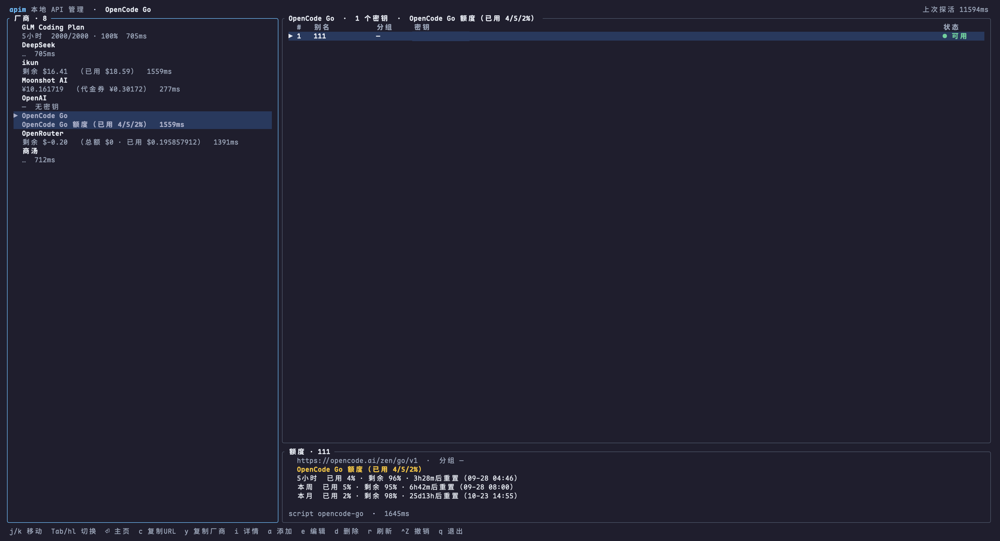

# apim

Manage model-provider API keys from the terminal: add, edit, delete, check health, check balance, copy, and one-click import into Codex or Pi.

**English** | [简体中文](README.zh-CN.md)

[](https://github.com/tututuhehehe/apim-cli/actions/workflows/release.yml)
[](https://github.com/tututuhehehe/apim-cli/actions/workflows/ci.yml)
[](LICENSE)

<p align="center">
  
</p>

> Note: the TUI and the `apim help` text are currently in Chinese. The CLI output and configuration formats are language-neutral. Localization contributions are welcome.

## Install

**One-liner (macOS / Linux)** — detects your platform, downloads the matching prebuilt binary, verifies its sha256 and installs it:

```bash
curl -fsSL https://raw.githubusercontent.com/tututuhehehe/apim-cli/main/install.sh | sh
```

`APIM_INSTALL_DIR` sets the destination (default: `/usr/local/bin` when writable, otherwise `~/.local/bin`); `APIM_VERSION` pins a version (e.g. `v0.1.0`; default is the latest release).

**npm (macOS / Linux / Windows)** — installs the prebuilt binary for your platform through a small wrapper:

```bash
npm install -g apim-cli   # or run it directly: npx apim-cli
```

**Manual download** — grab the archive for your platform from [Releases](https://github.com/tututuhehehe/apim-cli/releases). Assets are named `apim-<tag>-<target>.tar.gz` (`.zip` on Windows), each with a matching `.sha256` checksum. Extract it and put `apim` on your `PATH`.

```bash
# macOS Apple Silicon example
tag=v0.1.0
base="https://github.com/tututuhehehe/apim-cli/releases/download/$tag"
curl -fsSL -O "$base/apim-$tag-aarch64-apple-darwin.tar.gz"
tar -xzf "apim-$tag-aarch64-apple-darwin.tar.gz"
sudo mv apim /usr/local/bin/
```

| Platform | Asset suffix |
|---|---|
| macOS Apple Silicon | `aarch64-apple-darwin` |
| macOS Intel | `x86_64-apple-darwin` |
| Linux x64 | `x86_64-unknown-linux-gnu` |
| Linux arm64 | `aarch64-unknown-linux-gnu` |
| Windows x64 | `x86_64-pc-windows-msvc` (experimental; balance scripts require `sh`) |

**From source**:

```bash
git clone https://github.com/tututuhehehe/apim-cli.git
cd apim-cli
cargo install --path .
```

Rust users can also run `cargo binstall apim` to fetch the prebuilt binary — the crate is configured for it, and it starts working once the crate is published to crates.io.

### Uninstall

`apim uninstall` detects the same three channels as `apim update` and removes apim through the one that installed it — npm calls `npm uninstall -g apim-cli`, Homebrew calls `brew uninstall apim`, a plain install.sh binary is deleted (following a symlink so no dangling link is left behind). Dev builds under `target/` and `cargo install` copies in `~/.cargo/bin` are never deleted.

```bash
apim uninstall --dry-run   # report what would be removed, touch nothing
apim uninstall             # asks for confirmation, keeps your keys
apim uninstall --purge     # also deletes ~/.config/apim (config, recipes, scripts, secrets)
apim uninstall --yes       # skip the prompt (scripts / non-interactive)
```

Your keys are **not** deleted unless you pass `--purge`, and `--purge` refuses any directory whose name is not `apim` (and refuses to recurse into a symlinked config dir, so a dotfiles-managed `~/.config/apim` is left to you). `--dry-run` prints every path it would touch — including the symlink target when apim was installed through one; `--json` has the same shape in every case (on a dev build / `cargo install` copy it reports `channel: null` and exits non-zero instead of silently doing nothing).

What it deliberately leaves alone: anything in your shell rc / `PATH` (install.sh never writes those), and the files the [one-click import](#one-click-import-into-codex--pi) wrote under `~/.codex/` and `~/.pi/agent/` — they share a file with your hand-written config, so apim only **lists** them. To finish that cleanup by hand:

```bash
rm ~/.codex/apim-models.json                 # 1. the model catalog apim generated
# 2. in ~/.codex/config.toml: drop the [model_providers.apim-*] blocks plus the
#    top-level model_provider / model_catalog_json pointers
rm ~/.codex/config.toml.apim.bak             # 3. the pre-import backup — it holds a plaintext key too

# 4. in ~/.pi/agent/models.json: drop the providers.apim-* entries (plaintext apiKey)
rm ~/.pi/agent/models.json.apim.bak          # 5. the pre-import backup — it holds a plaintext key too
```

`apim uninstall` lists all five for you; it never deletes them itself.

## Usage

```bash
apim            # no arguments: launch the TUI
apim help       # CLI usage
apim --version  # version
```

## Keybindings

`a` / `e` / `d` / `c` act on the focused pane: the provider list on the left, or the key table on the right.

| Key | Provider list (left) | Key table (right) |
|---|---|---|
| `a` | Add provider | Add key |
| `e` | Edit provider (name / base URL / homepage / health path / balance) | Edit key (alias / group / token) |
| `d` | Delete provider (remove all its keys first) | Delete key |
| `c` | Copy base URL | Copy key |
| `y` | Duplicate the provider: copy the whole recipe into a new provider (id becomes `<id>-copy`, name gets a "副本" / copy suffix); an external balance script is copied to its own file so the two providers evolve independently. Keys in `secrets.toml` are not copied | — |
| `i` | Provider details (auth / endpoints / balance script / origin / vars — values are hidden) | Key details (`r` toggles the full token, `c` copies) |
| `Enter` | Open the provider homepage (console) in your default browser | — |
| `m` | — | Fetch the model list with **the selected key** (visibility depends on the key/group; in the dialog `/` focuses the search box for live filtering, `Esc` leaves search back to the list (filter kept), `j`/`k` scroll, `c` copies a model name, `Esc` closes) |
| `x` | — | One-click **import into Codex or Pi**: the selected key + its provider + the models you tick, written to the client's config. Steps: `⏎` to advance → pick a client → tick models (`space` toggles, `a` toggles all, `/` searches) → (Codex only) pick the default model (`j`/`k` move, `h` goes back, `⏎` imports; a single ticked model skips this step; Pi has no such step). See below |
| `j` / `k` | Move up/down | Move up/down |
| `Tab` / `h` / `l` | Switch panes (`h` = provider list, `l` = key table; no-op at the edge) | Same |
| `/` | Filter providers (matches id or display name) | Filter keys (matches alias or group) |
| `r` | Refresh health and balance | Same |
| `Ctrl+Z` | Undo the last write (providers/keys added, edited or deleted since the app opened, including files created by duplication); press repeatedly to step back | Same |
| `q` / `Esc` | Quit | Quit |

Press `/` to open the search box; filtering is live and case-insensitive, and each list keeps its own filter. `Enter` applies and closes it, `Esc` cancels and restores the previous value. While a filter is active the status bar shows `筛选: xxx (n/m)` ("filter: xxx") and `j`/`k` move only within the filtered rows; with no dialog open, `Esc` clears the filter instead of quitting (`q` still quits immediately). Note: while a filter is active, an item you rename or add that does not match it is hidden from view (the data is safe) — press `Esc` to clear the filter and see it again.

## CRUD

**Add a key (`a` in the right pane)**: fill in the alias, an optional group, and the key; switch providers with `←`/`→`. You can paste the key with `⌘V`. `Enter` saves, writes to disk immediately, and probes it.

**Add a provider (`a` in the left pane)**: fill in the ID (lowercase letters / digits / `-`; keys reference it via `provider`), a display name, the base URL, and three optional fields:

- **Homepage URL** — the provider's console, opened in your default browser with `Enter` on the provider; empty means unset (`Enter` will tell you). **Do not paste a one-click login link that contains a token** — the homepage shows up in the list and in `provider ls` output.
- **Health path** — defaults to `/models`, appended to the base URL; empty disables health checks.
- **Script path** — the balance script (see [Custom balance scripts](#custom-balance-scripts-the-one-and-only-balance-mechanism)); empty disables balance queries.

Saving creates `~/.config/apim/recipes/<id>.yaml`, after which `a` lets you add keys to it. You do not have to write the script yourself: paste `docs/quota-script-prompt.md` into any AI agent along with the provider's official query docs, and it will produce a script following apim's contract plus a verification command.

**Edit (`e`)**: the key form is pre-filled; changing the alias renames the key. In the provider form the ID is locked; if the health/script path is unchanged, saving leaves hand-written YAML untouched (inline scripts, `vars` access tokens, etc. are preserved). Clearing the script path removes the script balance. **After you save a changed provider config, that provider's cached readings and in-flight probes are invalidated and it is re-probed immediately with the new config** (so the panel never shows numbers computed from stale config); undoing a provider config change re-probes too.

**Delete (`d`)**: both ask for confirmation. A provider that still has keys is refused — delete the keys first. Built-in providers (DeepSeek / OpenAI / Moonshot AI / OpenRouter) cannot be deleted, but you can override them with `e` (this writes a YAML with the same id under your config dir).

**Duplicate (provider list, `y`)**: copies the selected provider wholesale — auth / vars / health path / balance binding (including any access token stored in `vars`); the id becomes `<source>-copy` (or `-copy-2`, … if taken) and the name gets a "副本" (copy) suffix. If it has an external balance script, the **file itself** is copied into `~/.config/apim/scripts/` (named after the new id, e.g. `glm-quota.sh` → `glm-copy-quota.sh`; an existing name is bumped to `-2`, `-3`, never overwritten), and the new provider points at the copy — afterwards the two scripts are independent. No script, or an inline `run`, means no file to copy. Keys in `secrets.toml` are **not** copied (what is duplicated is the protocol config, not credentials) — press `a` to give the new provider its own key.

**Undo (`Ctrl+Z`)**: every write since the app opened is recorded (provider/key add, edit and delete, plus YAML/script files created by duplication). Press `Ctrl+Z` on the main screen to step back one action at a time — memory and disk roll back together, and a toast at the bottom says what was undone (dialogs do not respond). Read-only actions (probing, copying to the clipboard, opening the homepage, browsing/searching) are not recorded; history is per-session and cleared when you quit the TUI.

**Inspect**: the status column shows the probe result (`● 可用` available / `● 失败` failed / `● 无额度` no balance), and the balance panel at the bottom right shows the selected key's balance. Press `i` for the details inspector: in the provider pane you see the whole recipe (auth / endpoints / balance script / origin / vars — variable values are shown only as `••••`); in the key pane you see everything, and `r` toggles the full token right there (no clipboard round-trip), while `c` copies. Refresh cadence: **every provider is probed once on open, then all of them are refreshed every 5 minutes** (health + balance together); switching providers reads the cache and triggers no request; `r` manually refreshes the current provider, and a newly saved key is probed immediately.

Inside a form:

| Key | Action |
|---|---|
| `Tab` / `↑` / `↓` | Next / previous field |
| `←` / `→` | Move the cursor; on the "provider" row, switch provider |
| `Enter` | Save |
| `Esc` | Cancel |

An empty required field, a duplicate ID, a base URL that does not start with `http(s)://`, and so on show a red message at the bottom and nothing is written.

## CLI (AI / script friendly)

The TUI is for humans, the CLI is for machines: after `cargo install --path .` every operation is available from the command line (`apim help` lists everything). They share the same data — a CLI change is immediately visible in the TUI and vice versa.

| Command | Description |
|---|---|
| `apim provider ls [--json]` | List providers (including balance binding mode and key count) |
| `apim provider add <id> --name <name> --base-url <URL> [--homepage <URL>\|none] [--health <path>\|none] [--script <path>\|none]` | Create a provider |
| `apim provider set <id> [--name <name>] [--base-url <URL>] [--homepage <URL>\|none] [--health <path>\|none] [--script <path>\|none]` | Update a provider (only the fields you pass) |
| `apim provider rm <id> [--force]` | Delete a provider (refused if it has keys; `--force` deletes them too; built-ins cannot be deleted) |
| `apim provider copy <src-id> [new-id] [--name <name>]` | Duplicate a provider (auth/vars/health/balance included; keys in `secrets.toml` are not); an external balance script is copied to its own file (named after the new id, existing names bumped to `-2`); the new id defaults to `<src-id>-copy` and auto-increments if taken |
| `apim key ls [<provider>] [--json]` | List keys (tokens masked) |
| `apim key add <provider> <alias> [--group <group>]` | Add a key; if it already exists, update its token |
| `apim key set <provider.alias> [--alias <new-alias>] [--group <group>\|none]` | Change alias / group |
| `apim key rm <provider.alias>` | Delete a key |
| `apim status [<provider>] [--json]` | Real health check + balance (runs the bound script) |
| `apim copy <provider.alias> [--base-url]` | Copy the key / base URL to the clipboard |
| `apim use <provider.alias>` | Print `export OPENAI_API_KEY=... OPENAI_BASE_URL=...` (for `eval $(apim use x)`) |
| `apim update [--check] [--force] [--json]` | Detects which channel installed this apim (**npm / Homebrew / install.sh**) and updates through the same one. The install.sh channel downloads **that release tag's** script and verifies its published sha256 before running it (no `curl \| sh`). `--check` only reports current-vs-latest; `--force` reinstalls even when versions match |
| `apim uninstall [--yes] [--purge] [--dry-run] [--json]` | Uninstalls through the same channel detection (see [Uninstall](#uninstall)). Keys survive unless you add `--purge`; `--dry-run` only reports; `--yes` skips the confirmation prompt |

**Key safety**: tokens always come from stdin, never from command-line arguments (so they never leak into `ps` or your shell history):

```bash
echo 'your-key' | apim key add glm main
```

### Binding a balance script

A provider's balance query = one bound script (the recipe's `balance.kind: script` + a `command:` pointing at an executable). Three equivalent entry points:

1. **TUI**: the "script path" field in the provider form.
2. **CLI**: `apim provider add/set ... --script <path>` to bind, `--script none` to unbind (CLI `set` is an explicit instruction and replaces the whole thing; it does not do the TUI's "leave it alone if unchanged" dance).
3. **Write the YAML directly**: the AI-authored route — see `docs/quota-script-prompt.md`.

Put scripts in `~/.config/apim/scripts/<provider-id>-quota.sh` (a convention, not a requirement). Once bound, `apim status <provider>` and the TUI balance panel run the same script with identical results; the script's I/O contract (environment injection, one panel line per stdout line, non-zero exit = error) is described under [Custom balance scripts](#custom-balance-scripts-the-one-and-only-balance-mechanism) below.

### End-to-end: adding a new provider with AI

```bash
# 1. Paste docs/quota-script-prompt.md into an AI, plus the provider's official query docs
#    -> the AI produces ~/.config/apim/scripts/<id>-quota.sh (and can run the install commands)
# 2. The AI registers the provider and binds the script:
apim provider add glm --name "GLM Coding Plan" --base-url https://open.bigmodel.cn \
  --health /api/monitor/usage/quota/limit --script ~/.config/apim/scripts/glm-quota.sh
# 3. You configure the key yourself (it never passes through the AI):
echo 'your-key' | apim key add glm main
# 4. The AI verifies:
apim status glm --json
```

## One-click import into Codex / Pi

Select a key in the key table and press `x` to write "this key + its provider + the models you tick" into a client config — no more hand-editing `~/.codex/config.toml`. Steps: **pick a client** (Codex or Pi) → **tick models** (same list as the `m` key; `space` toggles, `a` toggles all, `/` searches, `⏎` advances) → **pick the default model** — this last step is **Codex only**: one of the models you ticked becomes `config.toml`'s `model` (`j`/`k` move, `h` goes back, `⏎` imports); it is skipped automatically when you tick a single model, and Pi never shows it (see below).

Before reporting success it makes **the client itself read the new config** (`codex debug models` / `pi --list-models`) and checks that every ticked model is there; on failure the reason is shown right in the panel.

> **Codex reads the model catalog once, when its daemon starts, so `/model` only refreshes after a restart.** apim **restarts the codex app-server daemon for you** after a successful import (it kills the running one; codex spawns a fresh one on next launch) and says so in the toast. Set `APIM_NO_RESTART_CODEX=1` to disable that, then run `pkill -f "codex app-server"` yourself.
>
> Why this matters: the TUI and the desktop app both attach to the same long-lived daemon, and without a restart **`codex exec` already uses the new model while `/model` still lists the old ones** — the most confusing way for this to look like "the import didn't work" (cc-switch's own guide documents the same thing).

### What gets written where

**The models are *not* in `config.toml`** — that is Codex's own design (GLM's and DeepSeek's official Codex integration docs do it the same way): models live in a **separate JSON file** named by `model_catalog_json`, and `config.toml` only carries the pointer (apim also leaves a comment above it saying so).

| Location | Content |
|---|---|
| `~/.codex/config.toml` top level | `model_provider` = provider id, `model` = default model, `model_reasoning_effort` = default reasoning effort, `model_catalog_json = "apim-models.json"` |
| `~/.codex/config.toml` → `[model_providers.<provider-id>]` | `name` / `base_url` (`/v1` appended when missing) / `wire_api = "responses"` / `experimental_bearer_token` |
| `~/.codex/apim-models.json` | Metadata for the ticked models: each carries the `medium/high/xhigh/max` reasoning levels plus the default one. This is what `/model` reads |

Deliberate choices:

- **The ★ is read live, never remembered.** apim keeps **no** record of "what it last imported": on start, whenever you move between providers (`j`/`k`), on `r`, on the 5-minute auto refresh, and after every import it re-reads the clients' own config — for Codex the top-level `model_provider` → that `[model_providers.<id>]` block and its `experimental_bearer_token`; for Pi **every** credential it has configured — Pi has no single active provider (`defaultProvider` is only the startup choice), so apim scans `auth.json` (the `/login` credentials) and every `apiKey` in `models.json`. Pi's `auth.json` is **read-only** for apim — it also holds subscription credentials and Pi manages it under its own lock. The key that is **actually in use** gets `★C`/`★P` (`C`/`P` = client initials from `Agent::badge()`; several clients stack as `★C,P`). Hand-edit the config — swap the token, change the default provider, delete the block — and the ★ follows on the next refresh instead of lying to you. Matching is by **key**, not by name: a provider you named yourself, or Pi's built-in one, still gets the ★ if it is using one of your apim keys.
- **Switch the active provider, never rewrite the file.** Codex happily keeps several `[model_providers.*]` blocks at once but only activates the one named by `model_provider`. Importing therefore leaves the previous provider block intact (change `model_provider` back to switch), and your comments, `[projects.*]` and `[tui]` are preserved.
- **The price: the old block keeps its old token.** apim never prunes previous provider blocks, so the token you switched away from stays in plaintext in `~/.codex/config.toml`. Delete that block when you are done with the provider (or rotate/revoke the key on the provider side).
- **The key goes into `experimental_bearer_token`.** `~/.codex/config.toml` is already mode 600. If you rotate the key in apim, press `x` again to sync.
- **You never pick a reasoning effort**: every model in the catalog declares all four levels (`medium/high/xhigh/max`) and top-level `model_reasoning_effort` is always written as `high`. Change it per model via codex's own `/model`, or edit `apim-models.json` / `config.toml` by hand.
- **Every import is backed up**: the previous content is saved as `~/.codex/config.toml.apim.bak`; copy it back to roll back. Both the backup and the rewritten `config.toml` are forced to mode 600 (they hold a token — a 0644 file written by codex gets tightened too), and if codex fails to parse the result apim restores both files from that backup automatically. If `config.toml` is a symlink (dotfiles-managed), apim writes through it instead of replacing the link, and keeps the backup in `~/.codex/` rather than in your dotfiles repo.
- **The model entries are minimal, hand-written entries using codex's official fields** (GLM's and DeepSeek's official Codex integration docs, plus cc-switch's cross-version-tested minimal template): `shell_type: "shell_command"`, `apply_patch_tool_type: "freeform"`, one neutral `base_instructions` sentence (codex treats it as a required field), and both `supports_reasoning_summaries` and `supports_parallel_tool_calls` — fields **older codex versions treat as required**. Each model costs ~1.5KB, and nothing GPT-only (`code_mode_only`, `use_responses_lite`, an 872k context window, the 62KB GPT harness prompt) leaks onto a third-party model. The context window uses codex's own unknown-model default of 272000 — edit `apim-models.json` to set a real per-model value.
- **Verification uses your installed codex**: after writing, apim makes codex parse the new config (`codex debug models`) and only reports success when every ticked model is there.
- **Responses protocol only**: Codex 0.134+ removed `wire_api = "chat"`, so the relay must serve `/v1/responses` or you get a hard 400. The panel **does not second-guess endpoint capabilities**: it lists exactly the same models, from the same endpoint and parser, that the `m` key shows — whatever you tick is what gets imported.
- **Context window / input modalities**: generated entries use codex's unknown-model defaults (272000 window, `[text, image]`). To use a real per-model value (DeepSeek's official `/v1/models` returns `context_window`), edit that entry in `~/.codex/apim-models.json`.
- Provider ids that collide with Codex reserved names (`openai` / `ollama` / `lmstudio` / `amazon-bedrock*`) get an `apim-` prefix, e.g. `apim-openai`.
- The catalog **replaces** Codex's built-in model table rather than merging into it (verified: a catalog with one model makes `codex debug models` print exactly that one). So while a custom provider is active, `/model` lists only the models you ticked and the built-in OpenAI models disappear. To get the built-in table back, delete the `model_catalog_json` line from `~/.codex/config.toml`.

> Requires `codex` on your machine (it is used to generate and verify the model catalog). apim finds it on `PATH`, or you can point `APIM_CODEX_BIN` at it.

### One-click import into Pi

The same `x` panel targets **Pi** — pick `Pi` in step one (Pi needs only two steps: picking a default model is Codex-specific and is skipped). Pi takes a third-party provider as pure data (`models.json`), so apim writes exactly one place:

| Location | Content |
|---|---|
| `~/.pi/agent/models.json` → `providers.apim-<provider-id>` | `name` / `baseUrl` (`/v1` appended when missing) / `api = "openai-completions"` / `apiKey` / `models` (the ones you ticked) |

Deliberate choices:

- **The price of not touching `enabledModels`**: if you have that setting non-empty, `/model` starts in the scoped view and new models are not in it (nor in the `Ctrl+P` cycle) until you pick one and save it as your default (`Ctrl+S`) — which is exactly when Pi itself appends it. apim deliberately leaves that decision to you.
- **`settings.json` is not touched at all.** One-click import is "add the provider and the models I need to the list" — your default provider, default model and `enabledModels` are your own settings, and Pi already has `/model` + `Ctrl+S` for choosing a default. apim neither reads nor writes that file (there is a byte-for-byte test).

- **The provider key always carries an `apim-` prefix — but that only constrains *writing*.** Pi ships a large set of built-in providers (`deepseek`, `openai`, `openrouter`, …) and a same-named `models.json` entry **overrides that built-in provider's `baseUrl`** — i.e. it would quietly point your OpenAI models at the relay. A prefix can never collide, and it also tells you at a glance which entries apim wrote. Detection deliberately ignores the name: any provider — yours, or Pi's built-in — that is using one of your apim keys gets the ★.
- **Pi's `auth.json` is never written.** apim puts the key in `models.json` (`apiKey`), the shape Pi's own docs use for a compatible endpoint. `auth.json` holds your `/login` credentials — including OAuth refresh tokens for subscriptions — and Pi manages it under its own lockfile and validates every entry on load (one bad entry breaks the whole file), so apim only *reads* it, to work out which key is in use.
- **Only the keys apim owns are touched.** `headers`, `compat`, `modelOverrides`, `authHeader` and every other provider in `models.json` are preserved (there is a test pinning this), and `settings.json` is left alone entirely.
- **Model entries are minimal** (`id`, `name`, `reasoning: true`, `input: [text, image]`) and let Pi fill in its own conservative defaults (128000 context, 16384 output, zero cost) — apim does not invent numbers. Edit `models.json` if you want the real per-model values.
- **Verification uses your installed pi**: after writing, apim runs `pi --list-models` and requires every ticked model to show up **under our provider key**; on failure `models.json` is restored from its `.apim.bak` backup.
- **Nothing to restart**: unlike Codex, Pi has no long-lived daemon — open `/model` (or relaunch) and the new provider is there.
- **API keys only.** Pi's other path is subscription auth through `/login` (OAuth, credentials in `auth.json`); apim never writes that file (it only reads it, to work out which key is in use).

> Requires `pi` on your machine (it is used to verify the result). apim finds it on `PATH`, or you can point `APIM_PI_BIN` at it.

**Adding yet another client** (Claude Code …) is a Rust-side change: one `Agent` variant + one `clients/<id>/` submodule (write / verify / reload / detect) + one dispatch arm — the panel needs no changes. There is deliberately **no YAML recipe for clients**: their config formats, auth variable names and reload mechanisms all differ, so they are not the same protocol (see AGENTS.md convention 13).

## Where the data lives

Everything lives under `~/.config/apim/`. TUI edits write these two files directly (mode 600), and you can edit them by hand as well:

- `config.toml` — alias and group (no tokens)
- `secrets.toml` — the actual tokens, keyed by `"provider.alias"`

Import targets live outside that directory: `~/.codex/config.toml` + `~/.codex/apim-models.json` (Codex, backed up as `config.toml.apim.bak`) and `~/.pi/agent/models.json` (Pi, backed up as `models.json.apim.bak`; `PI_CODING_AGENT_DIR` overrides the directory). Pi's `settings.json` is never written — apim only *reads* `auth.json` (never writes it either) to work out which key is in use.

Nothing apim-side records the import: the ★ marker on a key row is computed from the client's own config (see above).

Hand-edit example:

```toml
# ~/.config/apim/config.toml
[[keys]]
provider = "deepseek"
alias = "default"
# group = "personal"   # optional
```

```toml
# ~/.config/apim/secrets.toml
[tokens]
"deepseek.default" = "sk-your-key"
```

```bash
mkdir -p ~/.config/apim
chmod 600 ~/.config/apim/config.toml ~/.config/apim/secrets.toml
```

Set `APIM_CONFIG_DIR` to relocate the whole config directory (used by the tests).

## Adding a provider

Built-in providers work out of the box: **DeepSeek, OpenAI, Moonshot AI and OpenRouter** are compiled into the binary — no recipe needed. Select one in the left pane and press `a` to add a key. (OpenAI's balance endpoint is only available to some accounts; an HTTP error in the balance panel is expected otherwise.) Dropping a YAML with the same id into `~/.config/apim/recipes/` overrides the built-in definition.

For a custom provider the easiest path is `a` in the left pane; saving the form generates `~/.config/apim/recipes/<id>.yaml`.

For complex providers (custom auth headers, multi-level JSON parsing) you can write the YAML directly into the same directory — see `recipes/deepseek.yaml`:

```bash
mkdir -p ~/.config/apim/recipes
cp recipes/deepseek.yaml ~/.config/apim/recipes/my-relay.yaml
```

YAML generated by the TUI form and hand-written YAML are equivalent; on edit the form only overwrites the fields it knows about, so hand-written headers and parsing rules survive.

### new-api style relays (balance needs an access token)

On most new-api panels `/v1/dashboard/billing/subscription` either returns fake numbers or rejects the API key. The real balance is at `/api/user/self`, but it only accepts an **access token** (the one generated in personal settings, not the `sk-` key). Write a script (`~/.config/apim/scripts/<id>-quota.sh`):

```sh
#!/bin/sh
# Put the access token in the recipe's vars: {access_token: ...}; apim injects APIM_VAR_ACCESS_TOKEN
RESP="$(curl -sS --max-time 10 \
  -H "Authorization: Bearer ${APIM_VAR_ACCESS_TOKEN:?}" \
  "${APIM_BASE_URL}/api/user/self")"
printf '%s' "$RESP" | jq -r '"remaining $\(.data.quota / 500000 | floor)  (used $\(.data.used_quota / 500000 | floor))"'
```

Bind it and store the access token in the recipe:

```yaml
vars:
  access_token: your-access-token
health:
  url: '{base_url}/v1/models'
balance:
  kind: script
  command: ~/.config/apim/scripts/<id>-quota.sh
```

Health checks still use each key's own `sk-` key; the balance uses the access token in `vars` (balance is account-level, so all keys of the same account show the same value). The file contains a token — keep it at mode 600 and do not share it.

### Model-list endpoint (`m`)

With a key selected in the key table, press `m` to fetch the model list visible to **that key** (visibility depends on the key/group). Endpoints are tried in order: an explicit `models_url` in the recipe → the health path (when it ends in `/models`) → `{base_url}/models` → `{base_url}/v1/models`, falling through on 404 (other errors are returned as-is, preserving the real cause). Almost every OpenAI-compatible provider needs no configuration; for non-standard paths like GLM, add one line to the recipe:

```yaml
models_url: '{base_url}/api/paas/v4/models'
```

### Custom balance scripts (the one and only balance mechanism)

**Every balance query is a script**: apim runs a script with the key and shows its stdout line by line in the balance panel (the first line is highlighted). How the script queries and computes is entirely up to you — a single request against a well-behaved API (DeepSeek / Moonshot / OpenRouter …) is a few lines of shell + jq, while multi-request, date-aware ones (GLM Coding Plan) fit just as well.

```yaml
balance:
  kind: script
  command: ~/.config/apim/scripts/glm-quota.sh   # external executable (shebang respected)
  # run: |                                        # or an inline script run via shell -c
  #   echo "remaining 45/100"
  timeout_secs: 15                                # default 15
```

Contract:

- apim injects the environment variables `APIM_TOKEN` (the key), `APIM_BASE_URL`, `APIM_ALIAS`, `APIM_PROVIDER`, plus `APIM_VAR_<UPPERNAME>` for each entry in the recipe's `vars`. The key travels only via the environment, never as a command-line argument (invisible to `ps`).
- exit 0: each stdout line becomes a panel line, the first highlighted; non-zero exit / timeout: stderr (truncated) is shown as a red error.
- The script may use anything on your machine (curl, jq, python, …) — it is essentially "how to query this provider's balance", expressed as config. Full GLM example: `~/.config/apim/scripts/glm-quota.sh` + `~/.config/apim/recipes/glm.yaml`.

You can configure it in the TUI too: it is the "script path" field in the provider form; if the path is unchanged on edit, hand-written `run:` / `shell:` / `timeout_secs` are preserved, and clearing it removes the script balance.

Let an AI write it: paste `docs/quota-script-prompt.md` into any agent along with the provider's official query docs (documentation / curl examples); it will produce the script + recipe and a verification command — the key is only passed through an environment variable during verification, never handed to the AI.

The recipes of the four built-ins (DeepSeek / OpenAI / Moonshot / OpenRouter) are compiled into the binary, but the scripts they reference live in `~/.config/apim/scripts/` and are **not** bundled with the binary. On a fresh machine, have an AI regenerate them following `docs/quota-script-prompt.md`, or copy the scripts directory from another machine.

## Releasing

Maintainer notes — release pipeline, npm and the Homebrew tap — are in [docs/RELEASING.md](docs/RELEASING.md).

## License

[MIT](LICENSE) © 2026 tututuhehehe
